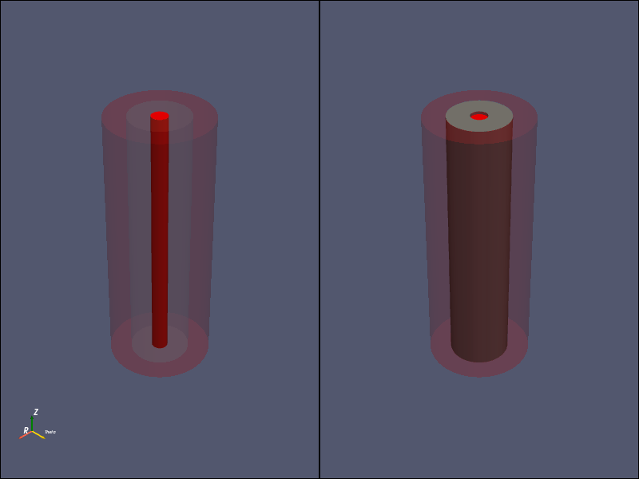

# Fluoride Salt Cooled High-Temperature Channel Flow

UMass Lowell Spring 2021  
Dept. of Chemical Engineering, Nuclear Program  
Engy-5330: Computational Continuum Transport Phenomena

View the project on `NBViewer`: 

Run the project on `Binder`: 

 >[Austin Rotker](https://github.com/arotker45), and [prof. Valmor F. de Almeida](https://github.com/dealmeidavf)  
 >[Dept. of Chemical Engineering (Nuclear Energy)](xxx)  
 >University of Massachusetts Lowell, USA  

|  |
|:---:|
|  |
| 
<b>Domain of salt flow: inside and outside a cylindrical annulus (nuclear fuel).</b>
 |

References:

 + [Eng-5330: Computational Continuum Transport Phenomena: course notes](https://github.com/dpploy/engy-5330)
 + [Multiphysics Object-Oriented Simulation Environment (MOOSE)](https://mooseframework.inl.gov/)
