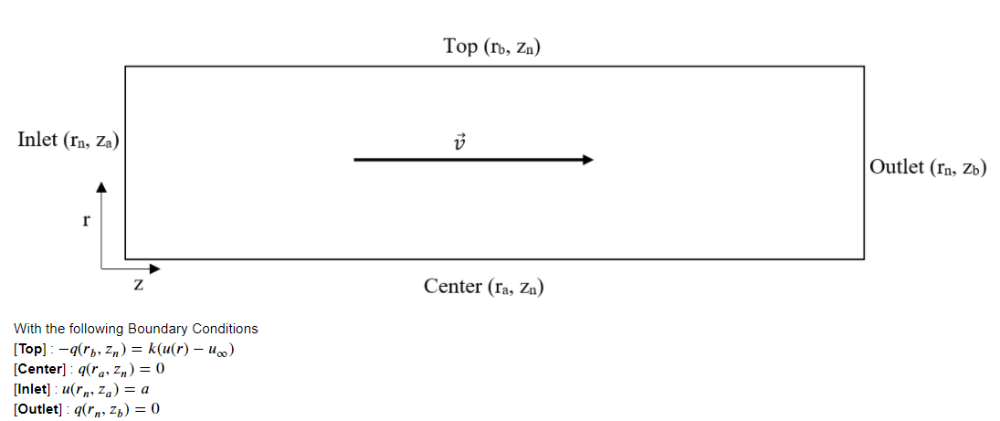
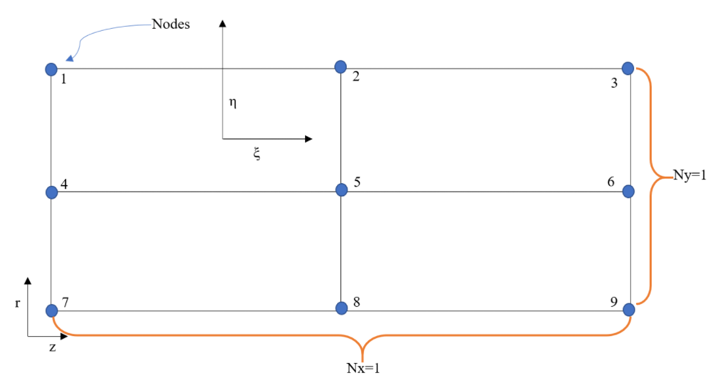
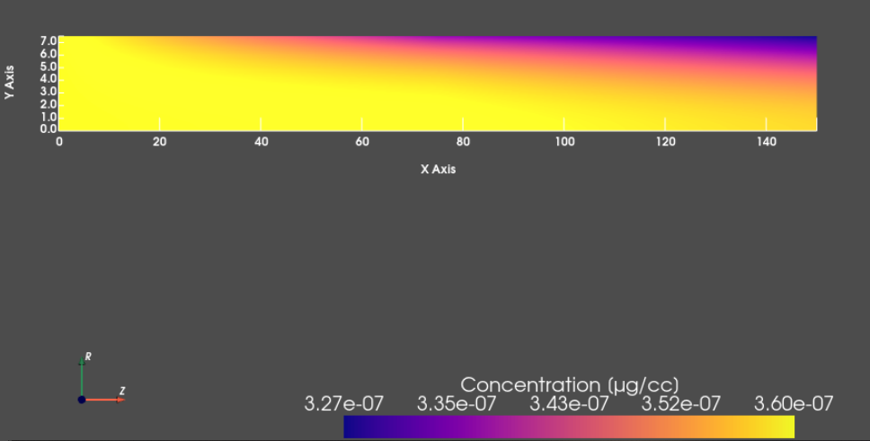

# Tritium Calculation for MSR

UMass Lowell Spring 2021  
Dept. of Chemical Engineering, Nuclear Program  
Engy-5330: Computational Continuum Transport Phenomena

View the project on `NBViewer`: 

Run the project on `Binder`: 

 >[Anthony G. Bowers](https://github.com/xxxx), and [Prof. Subash L. Sharma](https://github.com/SubashSharma1008)  
 >[Dept. of Chemical Engineering (Nuclear Energy)](xxx)  
 >University of Massachusetts Lowell, USA  

|  |
|:---:|
|  |
| 
<b>Problem domain sketch.</b>
 |
|  |
| 
<b>Quadratic finite element.</b>
 |
|  |
| 
<b> Results.</b>
 |

References:

- [1] V. F. de Almeida, [*Engy-5330: Computational Continuum Transport Phenomena*](https://github.com/dpploy/engy-5330),  University of Massachusetts Lowell, Dept. of Chemical Engineering (Nuclear Energy Program).
- [2] Multiphysics Object-Oriented Simulation Environment [(MOOSE)](https://mooseframework.org)
- [3] Stempien D. John, “Tritium Transport, Corrosion, and Fuel Performance Modeling in Fluoride Salt-Cooled High-Temperature Reactor (FHR)”. Massachusetts Institute of Technology. PDF. June 2017
- [4] R. Serrano-Lópeza, J. Fraderaa, S. Cuesta-Lópeza. “Molten salts database for energy applications”. PDF. September 2014.
