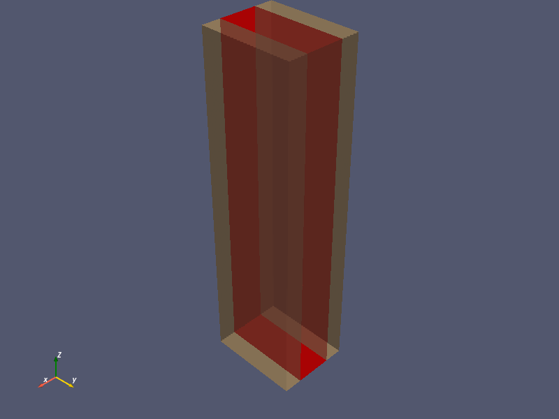
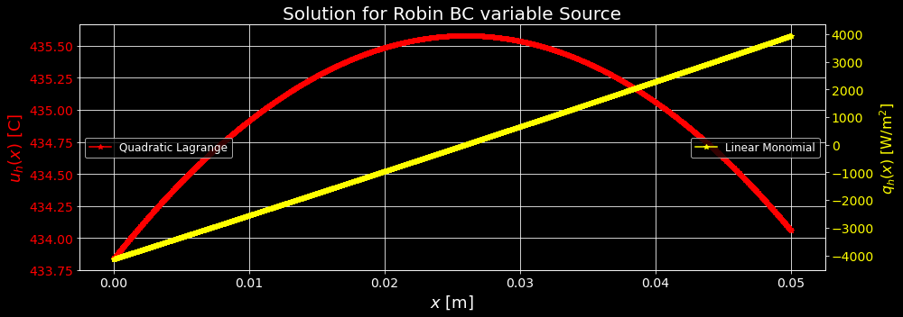

# FIRES Brick

UMass Lowell Fall 2021  
Dept. of Chemical Engineering, Nuclear Program  
Engy-5310: Computational Continuum Transport Phenomena

View the project on `NBViewer`: 

Run the project on `Binder`: 

 >[Shubhojit and Julian](https://github.com/pukaishubho), and [prof. Stephen Lam](url)  
 >[Dept. of Chemical Engineering (Nuclear Energy)](xxx)  
 >University of Massachusetts Lowell, USA  

|  |
|:---:|
|  |
| 
<b>Explain this domain.</b>
 |
| |
| 
<b>Explain this plot and change the title above it.</b>
 |

References:

 + [Eng-5310: Computational Continuum Transport Phenomena: course notes](https://github.com/dpploy/engy-5310)
 + [Multiphysics Object-Oriented Simulation Environment (MOOSE)](https://mooseframework.inl.gov/)
