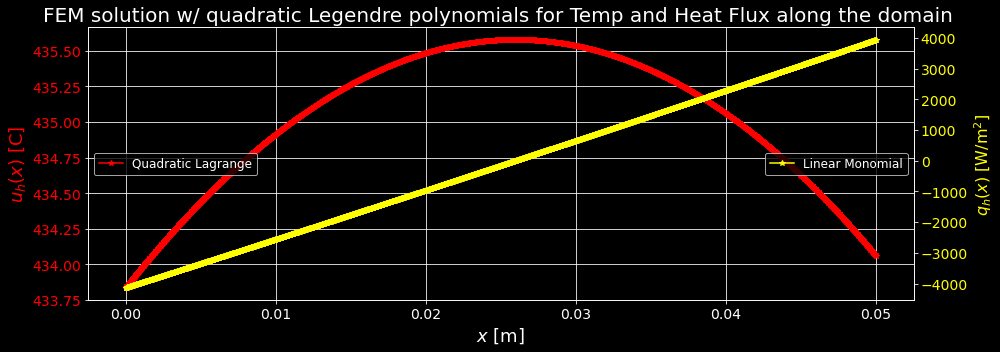

# FIRES Brick

UMass Lowell Fall 2021  
Dept. of Chemical Engineering, Nuclear Program  
Engy-5310: Computational Continuum Transport Phenomena

View the project on `NBViewer`: 

Run the project on `Binder`: 

 >[Shubhojit and Julian](https://github.com/pukaishubho), and [prof. Stephen Lam](url)  
 >[Dept. of Chemical Engineering (Nuclear Energy)](xxx)  
 >University of Massachusetts Lowell, USA  

|  |
|:---:|
|  |
| 
<b>This plot shows one of the inner wall of the bricks of the FIRES-project. The red slav indicates the brick, and the brown ones indicate air flowing through the channels of the brick, cooling both ends of the domain.  </b>
 |
| |
| 
<b>The red curv indicates the temperature as calculaated accross this domain. The yellow line is the heat flux along the same domain.</b>
 |

References:

 + [Eng-5310: Computational Continuum Transport Phenomena: course notes](https://github.com/dpploy/engy-5310)
 + [Multiphysics Object-Oriented Simulation Environment (MOOSE)](https://mooseframework.inl.gov/)
 + [Daniel Stack, [Development of high-temperature firebrick resistance-heated energy storage (FIRES) using doped ceramic heating system]
 + [Daniel Stack, Daniel Curtis, Charles Forsberg [Performance of firebrick resistance-heated energy storage for industrial heat applications and round-trip electricity storage]()
 + [James F. Shackleford, [CRC Materials Science and Engineering Handbook]()
-+ [ R. Bird, W. Stewart, E. Lightfoot [Transport Phenomena, Revised Second Edition]()
