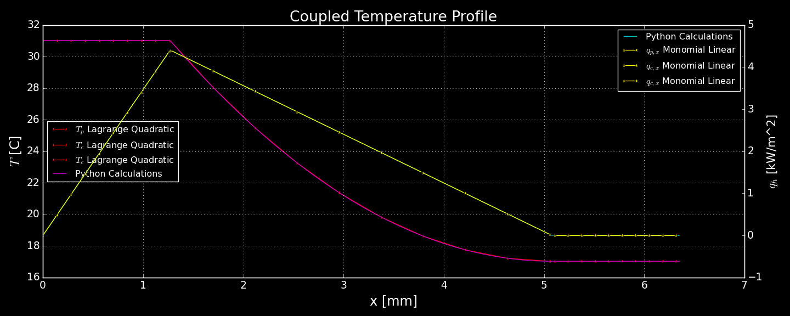

# Heated Plate

UMass Lowell Fall 2021  
Dept. of Chemical Engineering, Nuclear Program  
Engy-5330: Computational Continuum Transport Phenomena

View the project on `NBViewer`: 

Run the project on `Binder`: 

 >[Andrew Hamel](https://github.com/anhamel), [Lohith Annadevula](https://github.com/L-Annadevula), and [prof. Sukesh Aghara](url)  
 >[Dept. of Chemical Engineering (Nuclear Energy)](xxx)  
 >University of Massachusetts Lowell, USA  

|  |
|:---:|
|  |
| 
<b>Heat transfer between a heated plate, a fluid channel, and an unheated plate.</b>
 |

|  |
|:---:|
|  |
| 
<b>No-flux Neumann boundary conditions with a heat source in the left plate and an equivalent sink in the fluid channel.</b>
 |

References:

 + [Eng-5330: Computational Continuum Transport Phenomena: course notes](https://github.com/dpploy/engy-5330)
 + [Multiphysics Object-Oriented Simulation Environment (MOOSE)](https://mooseframework.inl.gov/)
