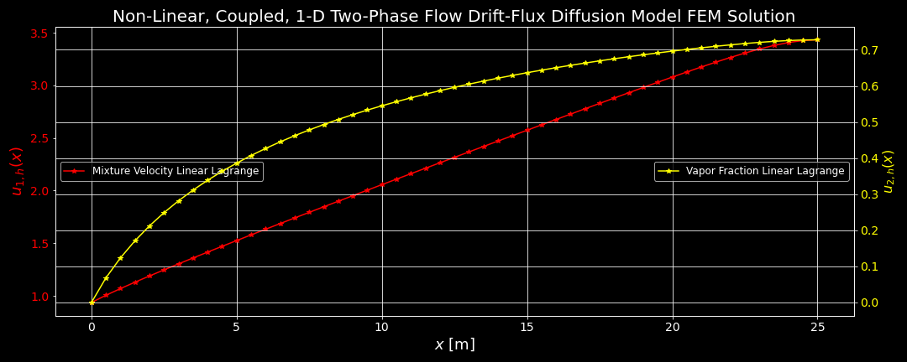

# A Diffusion Drift-Flux Model for Two-Phase Mixture Flow

UMass Lowell Fall 2020  
Dept. of Chemical Engineering, Nuclear Program  
Engy-4390: Nuclear Systems Design and Analysis

View the project on `NBViewer`: 

Run the project on `Binder`: 

 >[Jack Kennedy](https://github.com/xxxx), [Nik Kemper](https://github.com/xxxx) and [prof. Valmor F. de Almeida](https://github.com/dealmeidavf)  
 >[Dept. of Chemical Engineering (Nuclear Program)](https://www.uml.edu/Engineering/Chemical/faculty/de-Almeida-Valmor.aspx)  
 >University of Massachusetts Lowell, USA  

|  |
|:---:|
|  |
| 
<b>Two-phase fluid flow development in a nuclear heat exchanger.</b>
 |
|  |
| 
<b>Computational domain.</b>
 |
|  |
| 
<b>Computed vapor fraction and mixture velocity along pipe during phase change.</b>
 |

References:

 + [Cortix](https://cortix.org/)
 + [Eng-4350: Nuclear Reactor Engineering: course notes](https://github.com/dpploy/engy-4350)
 + [IAPWS 97 Standards](http://www.iapws.org/relguide/IF97-Rev.html)
 + [IAPWS PyPi Library](https://pypi.org/project/iapws/)

