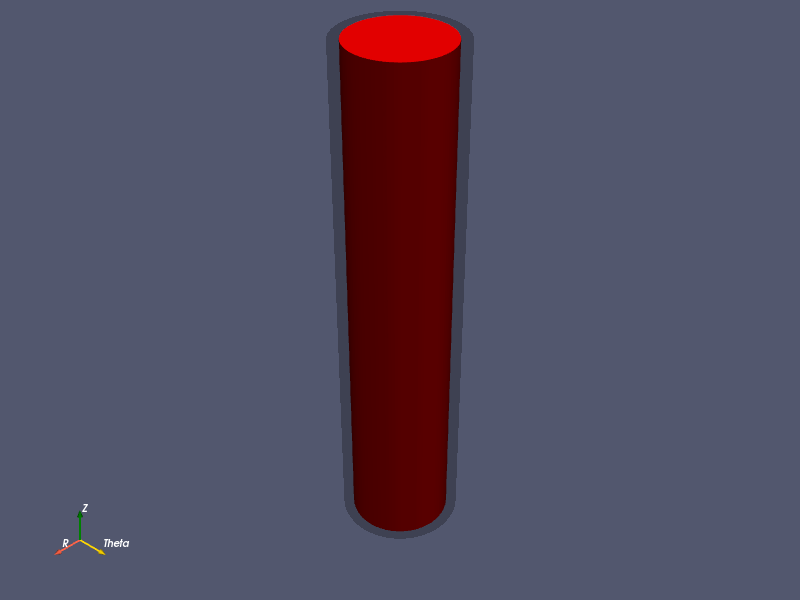

# Xenon-135 Removal from Molten Salt Reactors by Helium Gas Bubbles

UMass Lowell Spring 2021  
Dept. of Chemical Engineering, Nuclear Program  
Engy-5310: Computational Continuum Transport Phenomena

View the project on `NBViewer`: 

Run the project on `Binder`: 

 >[Anadi Mondal](https://github.com/xxxx), and [Anthony G. Bowers](https://github.com/xxx)  
 >Mentor: [Prof. Subash L. Sharma](https://github.com/SubashSharma1008)  
 >[Dept. of Chemical Engineering (Nuclear Energy)](xxx)  
 >University of Massachusetts Lowell, USA  

|  |
|:---:|
|  |
|  |

|  |
|:---:|
|  |
|  |

|  |
|:---:|
|  |
|  |

References:

 + [Eng-5310: Computational Continuum Transport Phenomena: course notes](https://github.com/dpploy/engy-5310)
 + [MOOSE](https://github.com/dpploy/engy-5310)
 + A.Bowers J,S. Sharma,M. Howley, “CFD Analysis of xenon-135 reomoval from molten salt reactors by helium gas bubbles”. ANS Conference,2020.
 + R.J Kedl,A. Houfzeel,"Development of a model for computing Xe-135 migration in MSRE".Oak Ridge National Laboratory .

